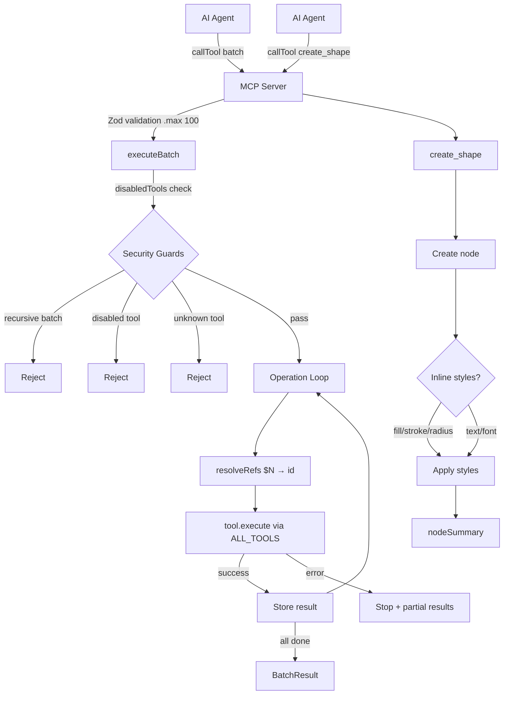

# Feature Summary: Batch/Composite Design Operations API

## Overview

The `batch` MCP tool allows AI agents to execute multiple OpenPencil operations in a single call, with `$N` references to chain results between operations. Combined with inline style properties on `create_shape`, this reduces full-page mockup creation from 50+ round-trip MCP calls to 1-3 calls.

## What Was Built

- **`packages/core/src/tools/batch.ts`** — `executeBatch()` function that dispatches to existing tools by name, `resolveRefs()` for `$N` reference resolution, `BatchOperation`/`BatchResult`/`BatchOptions` types
- **`packages/core/src/tools/create.ts`** — Enhanced `create_shape` with 8 optional inline style params: `fill`, `stroke`, `stroke_weight`, `radius`, `text`, `font_family`, `font_size`, `font_style`
- **`packages/core/src/tools/index.ts`** — Re-exports for batch module
- **`packages/mcp/src/server.ts`** — Custom Zod schema registration for `batch` tool with `.max(100)` and `disabledTools` enforcement
- **`tests/engine/batch.test.ts`** — 13 tests (12 unit + 1 integration)
- **`tests/engine/create-shape-inline.test.ts`** — 7 tests for inline styles
- **`tests/engine/mcp-server.test.ts`** — 5 new MCP server tests for batch
- **`README.md`**, **`CHANGELOG.md`**, **`packages/docs/programmable/mcp-server.md`** — Documentation updates

## Architecture



## Key Decisions

- **Meta-tool dispatching** over custom DSL — reuses all 70+ existing tools, zero duplication
- **`$N` array-index references** over named references — simpler, matches original feature request
- **Stop-on-first-error** over continue-on-error — design ops cascade, continuing after failure produces garbage
- **Defense-in-depth** for eval gate — `disabledTools` enforced at both MCP server and core layer
- **`maxOperations: 100`** default — prevents denial-of-service from excessively large batches

## How to Use

```json
{
  "operations": [
    { "tool": "create_shape", "args": { "type": "FRAME", "x": 0, "y": 0, "width": 440, "height": 580, "fill": "#161b22", "radius": 12 } },
    { "tool": "create_shape", "args": { "type": "TEXT", "parent_id": "$0", "x": 32, "y": 32, "width": 200, "height": 30, "text": "Dashboard", "font_size": 24 } },
    { "tool": "set_layout", "args": { "id": "$0", "direction": "VERTICAL", "spacing": 16, "padding": 24 } }
  ]
}
```

- `$0` references the `id` from the first operation's result
- Operations execute sequentially — each can reference any prior result
- On error: returns `{ results: [...completed], error: { index, tool, message } }`

## Testing

| Test file | Tests | Command |
|-----------|-------|---------|
| `tests/engine/batch.test.ts` | 13 | `bun test tests/engine/batch.test.ts` |
| `tests/engine/create-shape-inline.test.ts` | 7 | `bun test tests/engine/create-shape-inline.test.ts` |
| `tests/engine/mcp-server.test.ts` | 29 (5 new) | `bun test tests/engine/mcp-server.test.ts` |
| `tests/engine/tools.test.ts` | 32 (regression) | `bun test tests/engine/tools.test.ts` |

Total: 81 tests across 4 files, all passing.
